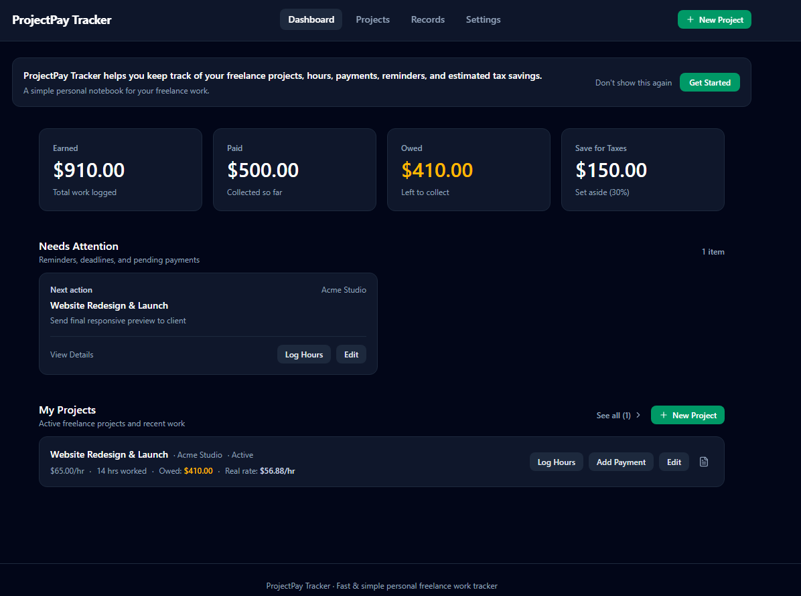
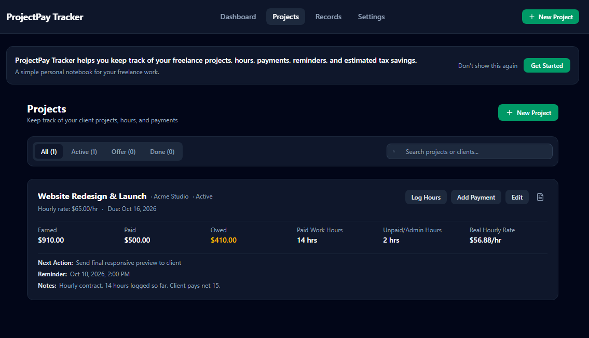
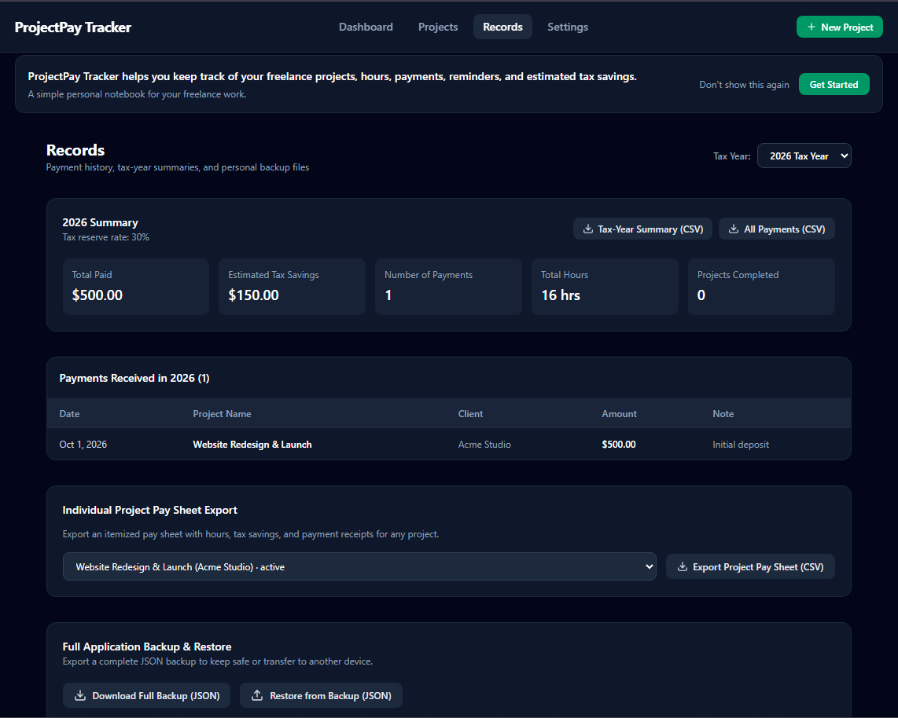

# ProjectPay Tracker

ProjectPay Tracker is a simple, local-first freelance work tracker for managing projects, hours, payments, reminders, and estimated tax reserves.

It is designed to be fast, private, and easy to use without requiring an account, bank connection, backend server, or AI service.

## Features

- Track hourly and fixed-price projects
- Log paid work hours and unpaid/admin hours
- Record individual payments
- Track Earned, Paid, and Owed amounts
- Estimate money to Save for Taxes
- Calculate real hourly rate
- Track next actions, reminders, and due dates
- Export payment history and tax-year summaries to CSV
- Export individual project pay sheets
- Print or save project pay sheets as PDF
- Backup and restore all app data with JSON
- Light, Dark, and System themes

## Privacy

ProjectPay Tracker stores project and payment data locally in your browser using local storage.

- No account required
- No bank connection
- No Gemini API
- No AI models
- No external data service
- No backend server
- No API key required

## Run Locally

### Prerequisites

- Node.js
- npm

### Install

```bash
npm install
```

### Start the Development Server

```bash
npm run dev
```

Open your browser and visit:

http://localhost:3000

## Build

Create a production build with:

```bash
npm run build
```

## Technology

- React
- TypeScript
- Vite
- Tailwind CSS

## Live Demo

https://projectpay-tracker-1.ai.studio

## Status

Version 1 - Stable

## Screenshots

### Dashboard
Track earnings, payments, outstanding balances, and estimated tax reserves.



### Projects
Manage freelance projects, work hours, payments, and deadlines.



### Records
Review payment history, export financial records, and manage backups.

